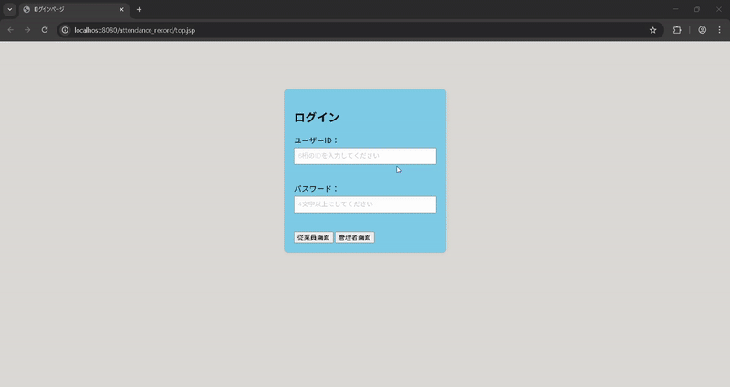

# 出勤/退勤アプリケーション

## 概要
従業員が出勤・退勤ボタンを押して打刻を行い、  
管理者が勤務履歴を一覧で確認できるシステムです。  
管理者画面から従業員IDや管理者IDの新規作成が可能です。

## 機能
- 従業員の出勤・退勤打刻
- 管理者による勤務履歴確認
- 管理者画面からのID新規作成
- パスワードのハッシュ化（jbcrypt.BCryptを利用）
- MySQLデータベース連携

## 使用技術
- Java / JSP / Servlet
- MySQL / JDBC
- Eclipse / Tomcat
- Git / GitHub

## 実行方法
1.  MySQLをインストール
2. `sql/attendance_record.sql` を実行してテーブルを作成
3. Eclipse上でTomcatを起動
4. ブラウザで `http://localhost:8080/プロジェクト名` にアクセス

